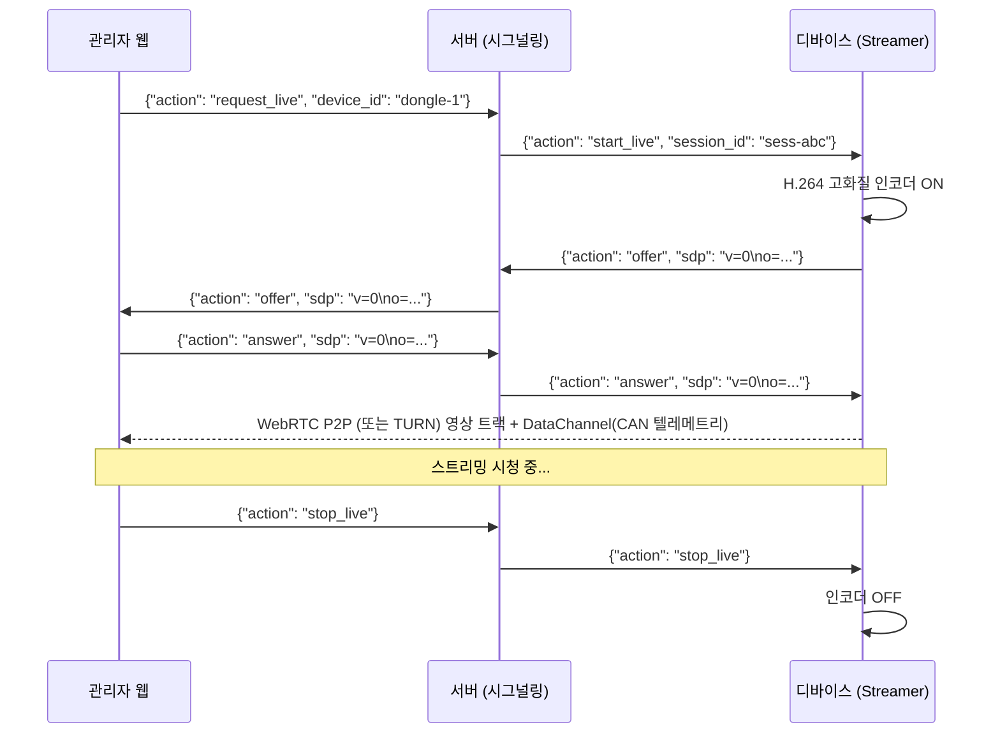

# 🛰️ Device Management & Streaming Server Specification

이 문서는 Openpilot 경량화 클라이언트와 연동할 **중앙 관제 및 기기 관리 백엔드 서버(API / WebRTC / WebSocket)** 명세서입니다. 별도의 백엔드 프로젝트(FastAPI, Node.js, Go 등)를 구현할 때 이 규격을 참고하여 개발합니다.

---

## 1. 🏗️ 전체 서버 아키텍처

```mermaid
flowchart TD
    subgraph Client [차량 디바이스 클라이언트]
        ConfigManager[config.py\n- Git 기본설정 / Params 오버라이드]
        Agent[agent/agentd.py\n- Heartbeat & 종합 상태 리포트\n- 서버 Config 수신 & Params 동기화]
        Logger[Log & Crash Uploader]
        Dashcam[Event Video Uploader]
        Streamer[2단계 스트리머 (썸네일/WebRTC)]
    end

    subgraph Server [백엔드 서버]
        API[REST API Gateway]
        WS[WebSocket Hub\n(썸네일 & 텔레메트리)]
        Signaling[WebRTC Signaling Server]
        MediaRelay[미디어 중계 / WebRTC SFU]
        DB[(RDBMS / Redis\n상태/설정/로그)]
        Storage[(S3 / MinIO / 로컬\n이벤트 영상 저장소)]
    end

    subgraph WebAdmin [관리자 웹 대시보드]
        Dashboard[차량 목록 & 썸네일 그리드]
        ConfigUI[원격 설정 / 브랜치 변경 UI]
        LivePlayer[실시간 고화질 뷰어 + 텔레메트리]
        EventViewer[이벤트 영상 재생 및 로그 뷰어]
    end

    Agent -->|종합 상태 보고 & Config 동기화| API
    Logger -->|로그 / 크래시 업로드| API
    Dashcam -->|이벤트 영상 업로드| API
    API --> DB
    API --> Storage

    Streamer -->|저화질 썸네일 (1 FPS)| WS
    Streamer <-->|WebRTC P2P/Relay| MediaRelay
    Streamer <-->|Signaling| Signaling

    WebAdmin <--> API
    WebAdmin <--> WS
    WebAdmin <--> MediaRelay
```

---

## 2. 📡 REST API 명세

기본 Base URL: `/api/v1`
모든 디바이스 요청은 헤더에 기기 고유 식별자(`X-Device-Id: {device_id}`) 또는 Authorization 토큰을 포함합니다.

### 2.1 디바이스 종합 상태 보고 & 원격 설정 (Heartbeat)
디바이스는 30초~60초마다 서버로 **종합 상태(버전, 브랜치, 리소스, 센서/CAN, 적용된 설정 등)**를 보고하며, 응답으로 서버의 최신 원격 설정을 수신하여 동기화합니다.

* **엔드포인트**: `POST /api/v1/devices/{device_id}/heartbeat`
* **Request Body (디바이스 -> 서버)**:
```json
{
  "timestamp": "2026-08-25T15:30:00Z",
  "software": {
    "version": "0.1.0",
    "git_branch": "master",
    "git_commit": "a1b2c3d",
    "applied_target_branch": "master",
    "updater_state": "idle",
    "last_update_time": "2026-08-25T10:00:00Z"
  },
  "system": {
    "cpu_usage_pct": 24.5,
    "memory_used_mb": 1024,
    "memory_total_mb": 4096,
    "disk_free_gb": 18.4,
    "disk_total_gb": 32.0,
    "temperature_c": 42.1,
    "network_type": "wifi", // "wifi", "cell", "none"
    "ip_address": "192.168.1.50",
    "uptime_seconds": 12450
  },
  "dashcam": {
    "recording": true,
    "pending_events_count": 2,
    "uploaded_events_count": 45
  },
  "applied_config_version": 3
}
```

* **Response Body (서버 -> 디바이스)**:
```json
{
  "status": "success",
  "server_time": "2026-08-25T15:30:00Z",
  "config_version": 4,
  "config": {
    "target_branch": "release-v1.2",
    "force_update": false,
    "storage": {
      "min_free_bytes_gb": 5,
      "normal_retention_hours": 24,
      "event_max_files": 100,
      "delete_uploaded_events_first": true
    },
    "logging": {
      "level": "INFO",
      "upload_interval_sec": 30,
      "max_log_size_mb": 10
    },
    "event_trigger": {
      "g_sensor_threshold": 1.5,
      "hard_brake_mps2": -4.0,
      "pre_event_seconds": 20,
      "post_event_seconds": 10
    },
    "stream": {
      "thumbnail_fps": 1,
      "thumbnail_quality": 40,
      "live_fps": 30,
      "live_bitrate_kbps": 2000
    }
  }
}
```

---

### 2.2 기기 설정 변경 (Admin Web -> Server)
* **엔드포인트**: `PUT /api/v1/devices/{device_id}/config`
* **Request Body**:
```json
{
  "target_branch": "feature/dashcam-test",
  "storage": {
    "min_free_bytes_gb": 4
  }
}
```

---

### 2.3 로그 및 크래시 리포트 수신
* **엔드포인트**: `POST /api/v1/devices/{device_id}/logs`
* **Request Body**:
```json
{
  "device_id": "dongle-123456",
  "log_type": "app", // "app" 또는 "crash"
  "entries": [
    {
      "timestamp": 1724567890.123,
      "level": "INFO",
      "module": "updater/ota.py",
      "message": "check_for_update: up to date on master",
      "context": {"commit": "a1b2c3d"}
    },
    {
      "timestamp": 1724567895.456,
      "level": "CRITICAL",
      "module": "camerad",
      "message": "uncaught exception: camera sensor timeout",
      "traceback": "Traceback (most recent call last):\n  File '...' line 45\n...",
      "context": {"device_state": "onroad"}
    }
  ]
}
```

---

### 2.4 이벤트 영상 업로드 수신
* **엔드포인트**: `POST /api/v1/devices/{device_id}/events`
* **Content-Type**: `multipart/form-data`
  * `metadata`: (JSON String)
    ```json
    {
      "event_id": "evt-20260825-153022-01",
      "event_type": "G_SENSOR_SHOCK",
      "occurred_at": "2026-08-25T15:30:22Z",
      "g_force": 1.82,
      "speed_kph": 62.4,
      "location": {"lat": 37.4979, "lng": 127.0276},
      "video_filename": "20260825_153022_event.mp4",
      "video_duration_sec": 30
    }
    ```
  * `video_file`: (Binary Video/MP4)

---

## 3. 📺 실시간 스트리밍 & 텔레메트리 프로토콜

### 3.1 1단계: 저화질 썸네일 스트림 (상시/목록 뷰)
* **프로토콜**: WebSocket (`WS /ws/v1/stream/thumbnail/{device_id}`)
* **전송 방향**: 디바이스 -> 서버 -> 관리자 웹 (1초 1프레임)
* **메시지 포맷 (JSON + Base64 또는 바이너리 JPEG)**:
```json
{
  "type": "thumbnail",
  "device_id": "dongle-123456",
  "timestamp": 1724567890.5,
  "telemetry": {
    "speed_kph": 65.0,
    "steering_angle_deg": -2.4,
    "brake_pressed": false,
    "gas_pressed": true,
    "gear": "D"
  },
  "image_base64": "/9j/4AAQSkZJRgABAQAAAQABAAD..."
}
```

---

### 3.2 2단계: 온디맨드 고화질 실시간 스트리밍 (요청-응답형)
관리자가 웹에서 특정 차량을 선택했을 때만 P2P 또는 SFU 중계로 고화질 H.264 영상을 스트리밍합니다.

* **시그널링 채널**: WebSocket (`WS /ws/v1/webrtc/signaling/{device_id}`)
* **동작 흐름**:


---

## 4. 🗄️ 데이터베이스 스키마 추천 (ERD 요약)

```sql
-- 기기 정보 및 상태/설정
CREATE TABLE devices (
    device_id VARCHAR(64) PRIMARY KEY,
    name VARCHAR(100),
    target_branch VARCHAR(100) DEFAULT 'master',
    current_branch VARCHAR(100),
    current_version VARCHAR(50),
    git_commit VARCHAR(40),
    system_status JSONB,       -- CPU, RAM, Disk, Temp 등 최신 상태
    config_json JSONB,         -- 원격 설정 JSON
    config_version INT DEFAULT 1,
    last_heartbeat_at TIMESTAMP,
    status VARCHAR(20) DEFAULT 'offline'
);

-- 로그 테이블
CREATE TABLE device_logs (
    id BIGSERIAL PRIMARY KEY,
    device_id VARCHAR(64) REFERENCES devices(device_id),
    log_type VARCHAR(20), -- app, crash
    level VARCHAR(20),
    module VARCHAR(100),
    message TEXT,
    traceback TEXT,
    context JSONB,
    created_at TIMESTAMP
);

-- 이벤트 영상 기록
CREATE TABLE device_events (
    event_id VARCHAR(64) PRIMARY KEY,
    device_id VARCHAR(64) REFERENCES devices(device_id),
    event_type VARCHAR(50),
    g_force FLOAT,
    speed_kph FLOAT,
    latitude FLOAT,
    longitude FLOAT,
    video_url TEXT,
    video_size_bytes BIGINT,
    occurred_at TIMESTAMP,
    created_at TIMESTAMP DEFAULT CURRENT_TIMESTAMP
);
```
